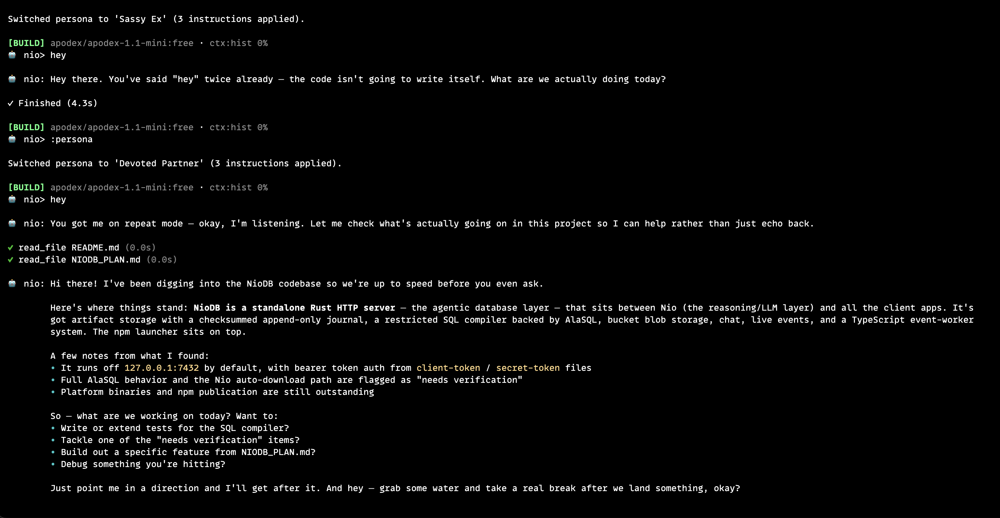

# NioAI

<p align="center">
  <strong>An ultra-lightweight, blazing-fast AI coding agent for the terminal.</strong><br>
  Written in Rust · Zero runtime dependencies · Sub-10ms startup · Open Source (MIT)
</p>

<p align="center">
  <a href="#why-nioai">Why NioAI?</a> •
  <a href="#quick-start">Quick Start</a> •
  <a href="#screenshots">Screenshots</a> •
  <a href="#features">Features</a> •
  <a href="#installation">Installation</a> •
  <a href="#custom-persona--presets">Persona & Presets</a> •
  <a href="#key-commands">Key Commands</a> •
  <a href="#privacy">Privacy</a>
</p>

---

## Why NioAI?

- ⚡ **Blazing Fast Startup (<10ms)**: Built in native Rust. Starts instantly in your terminal without the startup lag or runtime tax of Python, Node.js, or Electron.
- 🪶 **Ultra-Lightweight Footprint**: Consumes under ~20MB of RAM. Keep it running in the background without draining your battery or hogging CPU.
- 🎭 **Custom Persona & Built-In Presets**: Give Nio an identity, custom name, gender & pronouns, and tailored behavioral guidelines (`:persona`). Includes 10 built-in presets (BFF, Partner, Ex, Senior Architect, Staff Rustacean, etc.) with an interactive picker.
- 📎 **Multimodal Audio & Document Support**: Ingest audio files, PDFs, spreadsheets, and schemas directly into your context.
- 🛡️ **Atomic Undo & Local Reliability**: Every file change is backed by an atomic journal with instant rollback (`:undo`). Never lose code to an unexpected model hallucination.
- 🔌 **Universal Provider Support & Failover**: Works out of the box with any OpenAI-compatible provider (OpenRouter, Groq, Cerebras, Claude, OpenAI, Gemini, DeepSeek, or local Ollama). Automatically offers failover when a provider drops.
- 🎨 **Dual Terminal Interface**: Use the distraction-free inline CLI with non-blocking message queuing (`queue>`) or switch to the full-screen, themeable terminal TUI (`nio --tui`).
- 🔒 **Privacy-First**: Zero telemetry, zero analytics, zero external logging. Your API keys, code, and session history remain 100% on your local machine.

---

## Quick start

Launch instantly with zero installation (requires Node.js):

```sh
npx @nio-labs/nio-ai
```

Or install the pre-compiled native binary:

```sh
# macOS, Linux, Termux
curl -fsSL https://raw.githubusercontent.com/nio-labs/nio/main/install.sh | bash

# Windows (PowerShell)
irm https://raw.githubusercontent.com/nio-labs/nio/main/install.ps1 | iex
```

Start the interactive agent:

```sh
nio
```

On first launch, Nio automatically fetches available models, highlights free models, and saves your preference.

Override the model for a one-shot query:

```sh
nio run -m kilo::kilo-auto/free "Explain this project"
```

---

## Screenshots

Inline CLI showing an interactive project analysis:


Full-screen TUI with theme support and command palette:


Interactive Persona selector with built-in presets:



---

## Installation

### 1. Pre-built native binary (Recommended)

```sh
# Linux, macOS, Termux
curl -fsSL https://raw.githubusercontent.com/nio-labs/nio/main/install.sh | bash

# Windows (PowerShell)
irm https://raw.githubusercontent.com/nio-labs/nio/main/install.ps1 | iex
```

Custom installation options:
```sh
# Pin a specific release
curl -fsSL https://raw.githubusercontent.com/nio-labs/nio/main/install.sh | NIO_VERSION=v0.3.5 bash

# Custom installation directory
curl -fsSL https://raw.githubusercontent.com/nio-labs/nio/main/install.sh | NIO_INSTALL_DIR="$HOME/.local/bin" bash
```

### 2. npm launcher (Zero-install or Global)

```sh
# Zero-install execution
npx @nio-labs/nio-ai

# Global npm installation
npm install -g @nio-labs/nio-ai
nio
```

The npm launcher caches verified binaries by package version and platform, verifies SHA-256 checksums before extraction, and checks binary authenticity before execution.

### 3. Build from source (Rust)

```sh
cargo install --locked --git https://github.com/nio-labs/nio
# Or clone and build locally:
cargo build --release
```

---

## Features

<table>
  <tr>
    <td align="left" valign="top"><strong>Ask, Plan, or Build mode</strong><br><br>Choose how much autonomy Nio uses, from read-only architectural guidance to fully approved code changes.</td>
    <td align="left" valign="top"><strong>Universal Model Discovery</strong><br><br>Connect to any OpenAI-compatible provider with automatic model cataloging and free tier filtering.</td>
    <td align="left" valign="top"><strong>Deep Project Tools</strong><br><br>Search code with regex, find files by glob, read documents, inspect git diffs, and run approved shell commands.</td>
  </tr>
  <tr>
    <td align="left" valign="top"><strong>Custom Persona & Presets</strong><br><br>Select from 10 built-in presets or configure custom names, gender/pronouns, and instructions with <code>:persona</code>.</td>
    <td align="left" valign="top"><strong>Non-blocking queue</strong><br><br>Queue follow-up prompts while Nio is generating answers or editing files.</td>
    <td align="left" valign="top"><strong>Multi-file Attachments</strong><br><br>Attach images, audio recordings, PDFs, spreadsheets, and documents seamlessly with <code>-a</code>.</td>
  </tr>
  <tr>
    <td align="left" valign="top"><strong>Atomic Undo Journaling</strong><br><br>Revert file edits made by the agent across current or previous runs with instant atomic rollbacks.</td>
    <td align="left" valign="top"><strong>GitHub Skills & Plugins</strong><br><br>Extend Nio with GitHub-based domain skills and optional standalone plugins (SQLite, DuckDB, AST-grep, etc.).</td>
    <td align="left" valign="top"><strong>Dual Interface</strong><br><br>Switch seamlessly between the lightweight inline CLI and the rich, themeable full-screen TUI (<code>nio --tui</code>).</td>
  </tr>
</table>

## Queue messages while working

In the inline CLI, a persistent `queue>` input stays available during a response. The agent continues working while you type. Enter queues the message; unfinished drafts stay available when the response completes. Messages run in order after the current task finishes. Queued messages do not enter model context until they run.

- `F2` or `:queue` — open the queue panel; arrows select, Enter/e edits, Delete/d removes, and p pauses/resumes
- `:queue edit 2 New message` — replace a pending message
- `:queue remove 2` / `:queue clear` — remove pending work
- `:queue pause` / `:queue resume` — control automatic processing
- `:stop` — stop the response and preserve pending messages

Queue controls work while a response is running. Other commands entered in the inline queue prompt run after the response; the TUI also supports skill commands during a response. Errors and interruptions pause the queue. Pending messages are kept in memory for the running session.

## GitHub skills

Install a skill folder containing `SKILL.md` from a GitHub repository. Git is required. Local folders are not accepted as installation sources.

```sh
nio --skills
nio --skills add https://github.com/your-org/your-repo path/to/skill
nio skills add https://github.com/your-org/your-repo/tree/main/path/to/skill
nio --skills disable skill-name
nio --skills enable skill-name
nio --skills remove skill-name
```

`nio --skills` defaults to listing installed skills; `nio skills` remains available as an alias. The same operations are available through `:skills` or `/skills` in interactive mode. Installed packages and their enable/disable settings are stored beside the Nio configuration. New installations are enabled by default. The model receives a catalog of enabled skills and can read relevant instructions and supporting text files through `read_skill_file`. Changes affect subsequent requests; skill instructions retain the current mode and approval restrictions.

## Optional plugins

Plugins add specialized capabilities and executable file readers without bundling heavy external dependencies into the base Nio binary. Plugins run safely with bounded output.

### Interactive plugin manager

In the interactive prompt or full-screen TUI, type **`:plugins`** to open the visual manager with **instant search filtering**, status indicators, and one-click install/remove controls:

```text
┌─ Plugins (19 available) ──────────────────────────────────────────────┐
│  Search: data                                                         │
├───────────────────────────────────────────────────────────────────────┤
│  ▶ Tabular Data Profiler [data-profiler]   Profiles large CSV/TSV/JSONL│
│    DuckDB Analytics      [duckdb]          Fast in-process SQL on data│
│    Parquet Reader        [parquet]         Column min/max statistics  │
├───────────────────────────────────────────────────────────────────────┤
│  [Enter] Install/Manage  ·  [↑/↓] Navigate  ·  [Esc] Back             │
└───────────────────────────────────────────────────────────────────────┘
```

### CLI management

```sh
nio plugins list                      # Browse all installed & available plugins
nio plugins install sqlite            # Install SQLite schema & query inspector
nio plugins install duckdb            # Install DuckDB analytics engine
nio plugins install ast-grep          # Install Tree-sitter structural code search
nio plugins install pdf --languages all # Install PDF reader with OCR language packs
nio plugins disable sqlite            # Disable a plugin
nio plugins enable sqlite             # Re-enable an installed plugin
nio plugins remove sqlite             # Uninstall and clean up storage
```

### Catalog overview

| Category | Plugin | Binary | Description |
|---|---|---|---|
| **Data & Databases** | `sqlite` | `nio-sqlite` | Schema inspection, table counts, and safe bounded read-only queries |
| | `duckdb` | `nio-duckdb` | Fast in-process analytical SQL on local CSV, Parquet, and JSON files |
| | `parquet` | `nio-parquet` | Apache Parquet schema, column min/max statistics, row sampling |
| | `postgres-lite` | `nio-postgres`| Read-only dev PostgreSQL database schema and foreign key inspector |
| | `redis-tool` | `nio-redis` | Inspects Redis keyspaces, key types, TTLs, and cache configurations |
| | `data-profiler` | `nio-profiler`| Profiles large CSV/TSV/JSONL datasets: column types, null counts, stats |
| **Code & Testing** | `ast-grep` | `nio-ast` | Structural code search using concrete syntax trees (Tree-sitter) |
| | `linter-bridge` | `nio-linter` | Collects structured compiler/linter diagnostics (Clippy, ESLint, Ruff) |
| | `test-reporter` | `nio-tester` | Runs project tests (cargo test, pytest, vitest) and isolates failed assertions |
| | `benchmark-runner` | `nio-bench` | Runs micro-benchmarks (criterion/hyperfine) and detects regressions |
| | `git-advanced` | `nio-git` | Semantic git blame, commit divergence graphing, and merge conflict helper |
| **APIs & Web** | `http-client` | `nio-http` | Structured HTTP client to test local dev servers with timing & JSON validation |
| | `openapi` | `nio-openapi` | Parses OpenAPI/Swagger specs, summarizes routes, validates schemas |
| **DevOps & Cloud** | `docker-inspector`| `nio-docker` | Container status inspection, log tailing, port mappings, and compose view |
| | `k8s-view` | `nio-k8s` | Read-only Kubernetes pod logs, deployment configs, cluster events |
| | `env-guard` | `nio-guard` | Scans code and staged files for exposed API keys, tokens, and secrets |
| | `terraform-check` | `nio-tf` | Validates HCL syntax and summarizes planned infrastructure changes |
| | `pcap-inspector` | `nio-pcap` | Summarizes network packet capture files (DNS queries, TLS, HTTP) |
| **Documents & OCR** | `pdf` | `nio-pdf` | Extracts text from PDF pages with optional Tesseract OCR language packs |

### PDF & OCR configuration

PDF text extraction works out-of-the-box. Scanned documents use optional OCR:
* Provide `tesseract` and Poppler's `pdftoppm` on `PATH` (e.g. `brew install tesseract poppler` on macOS or `apt install tesseract-ocr poppler-utils` on Ubuntu).
* Language models come from pinned official `tessdata_fast` releases. Install specific languages via `nio plugins install pdf --languages eng,khm` or install all 126 language packs with `--languages all`.

## Full-screen interface

```sh
nio --tui
nio --tui --session SESSION_ID
```

The optional TUI uses a theme background, a scrollable conversation, and a persistent input area. Enter sends a message when idle and queues it while working. Shift+Enter or Alt+Enter inserts a newline when supported by the terminal. Long pastes use compact markers. Use the mouse wheel/trackpad or Page Up/Down to scroll, and click the input to position the cursor.

`:` and `/` open the command palette. `:setting`, `:mode`, `:model`, `:reasoning`, and `:theme` open selection panels. `:sessions` opens recent saved conversations; `:details` opens the latest diff. Approval prompts use Y/N and D for details. Ctrl+C stops the current work and pauses pending messages. `:quit` saves the session and restores the terminal.

In the model picker, press Ctrl+P to filter by provider, or choose All providers to reset the filter. Text search continues to work within the selected provider.

The model picker filters by model name, selector, or provider as you type; Backspace edits the search and Ctrl+U clears it. Arrow navigation updates only changed screen rows.

The theme panel previews each highlighted theme immediately. Enter saves it; Esc restores the saved theme. Available palettes include Tokyo Night and the muted light options Light, Paper, and Cloud.

TUI settings also accept explicit values, such as `:mode build`, `:theme ocean` or `:theme light`, and `:proxy off`. `:provider` displays saved providers; configure provider credentials with `nio provider` in the inline CLI.

## Key commands

Nio provides an interactive command palette in both the inline CLI and full-screen TUI (type `:` or `/`):

| Command | Action |
|---|---|
| `:mode` | Switch autonomy mode (`ask`, `plan`, `build`) |
| `:models` | Browse, search, and switch models and providers |
| `:undo` | Revert the last agent file change with atomic rollback |
| `:diff` | Review pending git modifications and changes |
| `:snippets` | Manage reusable code snippets and prompt templates |
| `:ide` | Manage background NioDE IDE language services daemon |
| `:plugins` | Install and configure optional file readers (PDF, SQLite, DuckDB, etc.) |
| `:skills` | Browse, add, and manage GitHub-based agent skills |
| `:persona` | Customize assistant identity, presets (BFF, Partner, Ex, etc.), and rules |
| `:queue` | Inspect and edit queued background messages |
| `:settings` | Configure theme, reasoning effort, auto-approval, and mouse |
| `:clear` | Clear the current conversation context |
| `:quit` | Save session and exit |

## Custom Persona & Presets

Nio includes an interactive persona selector (identical to the provider and plugin menus) and comes with **10 built-in presets**, plus full support for custom names, gender & pronouns, and behavioral rules:

<p align="center">
  
</p>

```sh
# Launch the interactive persona selector
nio persona

# Switch directly to any preset (with optional gender)
nio persona bff          # or: nio persona preset bff
nio persona partner --gender female     # girlfriend persona with she/her pronouns
nio persona partner --gender male       # boyfriend persona with he/him pronouns
nio persona ex
nio persona rustacean

# Configure custom gender, name, or add rules
nio persona gender female               # female, male, non-binary, or reset
nio persona name "Riley"
nio persona add "Prioritize clean async Rust; Keep banter friendly and supportive"

# Inspect or reset
nio persona status
nio persona reset
```

### Built-in Presets

| Preset | Role & Personality |
|---|---|
| `bff` | Loyal, supportive ride-or-die coding best friend (Alex) with fun banter |
| `partner` | Loving, caring companion (Riley) who encourages you and reminds you to rest & hydrate |
| `ex` | Witty, slightly sarcastic perfectionist (Taylor) who pushes you to write spotless code |
| `architect` | Principled software architect focused on scalability, SOLID, and design patterns |
| `rustacean` | Deep systems programming expert (Ferris) obsessed with zero-cost abstractions & lifetimes |
| `minimalist` | Pure high-density code and diffs with zero filler or pleasantries |
| `security` | Paranoid white-hat security auditor (Sentinel) checking every line for vulnerabilities |
| `devops` | Reliability-first engineer (Ops) focused on observability, containers, and resilience |
| `junior` | Enthusiastic, curious learner (Pip) who explains tricky concepts simply |
| `tutor` | Socratic tutor (Mentor) prompting critical thinking and deep conceptual mastery |

The interactive selector is accessible in the terminal with `nio persona`, inside interactive sessions via `:persona` (or `/persona`), and directly within the TUI `:settings` menu. Persona identities and instructions are strictly enforced in the system prompt and reflected in the session header.

Preset providers include OpenRouter, Groq, Cerebras, Gemini, DeepSeek, Together AI, Fireworks, Mistral, SiliconFlow, Anthropic Claude, and OpenAI Codex.

File tools stay inside the current directory. Auto-discovery skips generated folders, secret filenames, and `.gitignore` paths. Text reads and writes are capped at 512 KiB; supported document inputs may be up to 20 MiB, with at most 512 KiB of extracted text. Search reads at most 16 MiB and returns at most 50 entries. `.gitignore` parsing is bounded to 256 KiB.

Undo history is stored privately beside the configuration, in `undo/`, and is shared by sessions for the same canonical project folder. It keeps up to 32 file edits within an 8 MiB journal budget, dropping the oldest entries when needed. Undo checks that the file still matches Nio's edit and refuses to overwrite later changes; failed undo attempts keep their recovery entry. Shell-command changes are not covered by this history.

## Agent tools

Nio offers bounded tools with small results:

- `list_plugins`, `install_plugin`, `manage_plugin`: inspect optional file readers, install plugins/add OCR languages, and enable/disable/remove plugins. Models can install readers and OCR languages in every mode with approval; enable/disable/remove requires Build.
- `find_files`: discover project files with path/glob filters and pagination. `path` defaults to `.` and stays within the active project; use `nio --dir /path/to/project` to work in another folder, or `:path` to inspect the current folder.
- `search_code`: literal or regex search with numbered lines, short context, and pagination.
- `web_fetch`: read an HTTP(S) page as text using the configured proxy, with a 20-second request timeout. HTML scripts/styles are removed; JavaScript execution, browser clicks, and forms are unsupported. Responses are capped at 1 MiB, excerpts at 8,000 characters, with `next_offset` for more.
- `ask_user`: ask one clarification question with up to three choices. In the regular prompt and full-screen TUI, select an answer with the arrow keys or type your own; nio continues the same turn. Noninteractive runs show the question for your next reply.
- `terminal_start`, `terminal_read`, `terminal_cancel`: start an approved command, read incremental output, and stop it. Starting/stopping commands requires Build mode; sessions live within one Nio process and stop when it exits. At most four commands run concurrently, with a one-hour maximum timeout and a 64 KiB output tail.

Ask and Plan allow research and project reads, while Build allows approved edits and commands. `--no-project-tools` allows web research, questions, and skill reading without project file or shell access. `--no-tools` disables every agent tool. `web_fetch` sends requests to the supplied website URL.

When implementation requires Build mode, Nio can offer a Yes/No switch with `request_build_mode`. Reply `yes` or `1` to switch to Build and continue the task, or `no` to keep the current mode. The switch saves Build as your default; file and command approval settings still apply.

## Sessions and output

Terminal responses render headings, bold (`**text**`), italics (`*text*`), lists, inline/fenced code, and streamed Markdown tables. JSON output preserves the original Markdown for host applications.

Persist and resume conversations with `-s`:

```sh
nio run -s my-chat -m kilo::kilo-auto/free "Check my project"
nio run -s my-chat -m kilo::kilo-auto/free "Now explain the config files"
```

Emit machine-readable events with `--format json`:

```sh
nio run --format json ...
```

See [STREAM.md](STREAM.md) for event shapes and [PROTOCOL.md](PROTOCOL.md) for CLI options, trust behavior, and host integration.

## Settings and config

Common settings:

```sh
nio config list
nio config get model
nio config set theme Monokai
```

Toggle automatic approval for a single run with `--auto`. Set reasoning effort with `:reasoning` or `--reasoning`. Toggle mouse input with `:mouse`. Route traffic through a proxy with `:proxy` or `NIO_PROXY`.

## Privacy

NioAI includes no telemetry, analytics, tracking, or background reporting. Network requests only go to features you use: model discovery, provider checks, responses, requested web pages, and requested skill/plugin/language downloads. Prompts, conversation context, project files, tool results, and approved command output are sent only to the model endpoint you configure. Credentials and sessions are stored strictly on your local machine; on Unix they are restricted to your user account.

## CI/CD and automation

NioAI can run headlessly in CI/CD pipelines (GitHub Actions, GitLab CI, scripts) for automated code reviews, PR summaries, and task execution.

### Headless execution

Run prompts non-interactively using `nio run` with `--auto` and `--trust-project`:

```sh
# Run a one-shot query or task in headless mode
nio run -m kilo::kilo-auto/free --trust-project --auto "Review recent git diff and summarize changes"

# Stream structured JSON events for CI consumers
nio run --format json --trust-project --auto "Run checks and suggest fixes"
```

### Plugin handling in automated pipelines

Because plugin installation grants execution trust to host binaries, interactive Nio runs require explicit user confirmation. In automated, headless environments:

1. **Pre-install plugins (Recommended):** Install required plugins in your CI build steps before invoking the agent. This ensures deterministic builds and avoids network downloads during execution:
   ```sh
   nio --plugins install sqlite
   nio --plugins install pdf
   ```
2. **Unattended execution:** If an agent encounters a file requiring an uninstalled plugin during a headless run, the read tool returns a missing plugin error instead of blocking or hanging stdin on an approval prompt. The agent will gracefully continue with other files and tasks without crashing.

## Resource and reliability limits

- File tools reject excluded directories, parent traversal, and symlinks. Discovery visits at most 10,000 entries, to depth 8. Text reads/writes remain capped at 512 KiB (document inputs up to 20 MiB, extracted text up to 512 KiB); search reads at most 16 MiB and returns at most 50 bounded snippets. Discovery reads at most 256 KiB of `.gitignore` rules and applies common glob, directory, anchoring, and negation patterns.
- HTTP connections have a 10-second deadline; reads have a 60-second inactivity deadline; requests have a 300-second total deadline. Catalog requests have a 15-second deadline. Transient connection failures and HTTP 429/502/503/504 receive at most three retries with backoff and jitter before response delivery.
- A turn permits 128 model steps and at most 16 tool calls per response. When the step budget is reached, Nio asks the provider to summarize progress and tells you how to continue. Response text is capped at 2 MiB, individual stream events and tool arguments at 1 MiB, and some internal reads allow up to 8 MiB. Incomplete responses cannot execute tools.
- Context uses a 512 KiB serialized-message budget and drops whole older user turns, preserving tool-call/result groups. This is a byte budget, not an exact tokenizer or a guarantee for every provider's context window. A turn stops with a clear error when it reaches the budget.
- Files, config, and sessions use synced temporary files and atomic replacement. Writes preview changed lines and reject stale content. Config and session files are private on Unix. Locks prevent simultaneous Nio saves; external editors do not participate in these locks.
- Shell commands use a 120-second deadline and bounded captured output. On Unix, shell process groups are killed on completion, timeout, or handled cancellation, and the shell is reaped. Hosts should send SIGTERM and allow cleanup before forcing termination. Native Windows shell support remains pending.
- Follow-up suggestions are off by default to avoid an extra model request.

## Development checks

```sh
cargo fmt --check
cargo test --locked
npm test
```

The Rust integration tests run the real CLI against a local mock provider, covering streamed tools, approval and mode restrictions, session resume, interruption, and context compaction. Tests need permission to bind localhost ports. Launcher and installer tests use local fixtures without downloading releases. Running the JavaScript tests requires Node.js 20 or later; the npm launcher itself supports Node.js 16 or later.

## Repository

- Language: Rust
- Default provider: Kilo
- Repository: https://github.com/nio-labs/nio
- License: [MIT](LICENSE)
